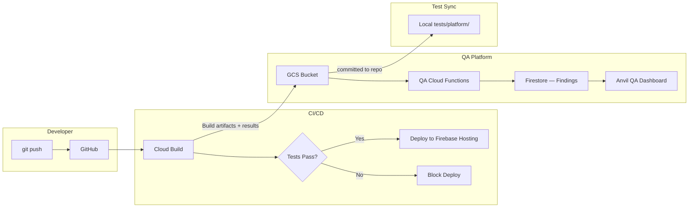
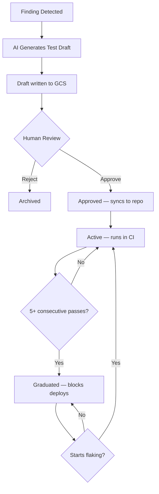

# QA Platform Architecture — Sparfuchs QA

System design for the Sparfuchs QA Platform. This document covers the deployment
pipeline, test generation flow, Firestore schema, anti-hallucination layers,
local orchestration, multi-LLM agent execution, and credential management.

---

## Pipeline Overview



Cloud Build runs canaries and unit tests on every push. Build results and
artifacts are written to a GCS bucket. QA Cloud Functions process these
results, detect gaps, and write findings to Firestore. The Anvil QA Dashboard
surfaces findings for human review.

---

## Test Generation and Graduation Flow



The feedback loop is unidirectional: findings flow from the platform into
the repo as tests. Developers never push tests back to GCS. Human review
is the mandatory gate between AI-generated drafts and CI execution.

---

## System Boundaries

| Component | Project | Runtime |
|-----------|---------|---------|
| QA Cloud Functions | `<your-gcp-project>` | Cloud Functions v2 (Node 20) |
| QA Firestore | `<your-gcp-project>` | Firestore (qa_* collections) |
| GCS Test Bucket | `<your-gcp-project>` | `gs://qa-platform-tests` |
| Anvil QA Dashboard | Anvil repo | React MFE in Anvil shell |
| Canary Runner | In-repo | `npx tsx` (local + Cloud Build) |
| AI Baseline Checker | QA Cloud Function | Scheduled (daily) |

The QA Platform shares the dev GCP project but uses isolated Firestore
collections (prefixed `qa_`) and a dedicated GCS bucket. No QA data
touches the main application Firestore collections.

---

## Local Architecture

The sparfuchs-qa codebase provides a comprehensive local QA execution layer
with multi-LLM orchestration, credential management, and observability.

| Component | Location | Purpose |
|-----------|----------|---------|
| Canary Runner | `canaries/index.ts` | Loads and runs all `*.canary.ts` files, optionally pushes to Firestore |
| Orchestrator | `lib/orchestrator/` | Multi-LLM agent execution engine with integrity validation |
| Agent Parser | `lib/orchestrator/agent-parser.ts` | Parses `.claude/agents/*.md` files, validates syntax, generates content hashes |
| Agent Runner | `lib/orchestrator/agent-runner.ts` | Executes a single agent with model resolution, retries, and fallbacks |
| Config Loader | `lib/orchestrator/config.ts` | Loads models.yaml, resolves provider keys, enforces data classification |
| Credential Store | `lib/orchestrator/credential-store.ts` | OS keychain integration for encrypted API key storage |
| Observability | `lib/orchestrator/observability.ts` | Tracks agent execution metrics (duration, tokens, tool calls, errors) |
| Quality Auditor | `lib/orchestrator/quality-auditor.ts` | Post-run validation (finding counts, severity distribution, hallucination risk) |
| Credential Manager | `lib/credentials/credential-manager.ts` | Loads and validates credentials from env var `SPARFUCHS_CRED_FILE` |
| Setup Wizard | `lib/credentials/setup-wizard.ts` | Interactive credential setup (5 auth strategies) |
| Findings Manager | `scripts/qa-findings-manager.ts` | Persistent finding registry with lifecycle states (open → remediated → verified → closed) in JSONL format |
| Flaky Test Tracker | `scripts/flaky-test-tracker.ts` | Detects flaky tests (candidate at 2 flips, confirmed at 5 flips) |
| Delta Reporter | `scripts/qa-delta-report.ts` | Compares findings across runs (new/fixed/regressed) |
| Evolution Engine | `scripts/qa-evolve-v2.ts` | Analyzes finding patterns, suggests threshold evolution |
| File Audit Cache | `scripts/file-audit-cache.ts` | Incremental auditing — tracks which files audited at which commit |
| Package Verifier | `scripts/package-verify.ts` | SBOM generation + provenance attestation checking |

---

## Multi-LLM Orchestration

The orchestrator enables seamless execution across three AI providers with
configurable model tiers and data-classification-aware routing.

**Providers:**
- `xai` — Grok
- `google` — Gemini
- `anthropic` — Claude

**Model Tiers:**
- `heavy` — Complex reasoning (prompts >5K tokens)
- `mid` — General analysis
- `light` — Quick checks and classification

**Data Classification:**
Each provider is assigned a data classification level (`public`, `internal`,
`restricted`), enforced at agent execution time to prevent sensitive data
leakage to untrusted providers.

**Integrity Validation:**
Agent integrity is verified via content hashes stored in `config/agent-hashes.json`.
On load, each agent's SHA-256 hash is compared to the stored value. Token usage
is tracked per agent via the ObservabilityTracker.

---

## Credential System

The credential system supports five authentication strategies with secure storage
and automatic cleanup.

**Auth Strategies** (in `lib/credentials/strategies/`):
- Email + Password — Firebase sign-in
- API Token — Bearer token
- OAuth Token — Third-party OAuth flow
- Basic Auth — Base64-encoded credentials
- None — Public APIs

**Credential Flow:**
1. Setup wizard prompts for auth method
2. Credentials written to temp file in `/tmp` (mode 0600)
3. Agents read via env var `SPARFUCHS_CRED_FILE`
4. Auto-deleted on cleanup or session exit

**API Key Storage:**
Multi-LLM provider keys (xai, google, anthropic) are stored in the OS keychain:
- **macOS:** `security` framework
- **Linux:** `secret-tool` CLI

Keys are loaded by `credential-store.ts` at agent execution time.

---

## Finding Lifecycle

Findings are tracked in persistent JSONL format via `qa-findings-manager.ts`
and move through a multi-stage lifecycle.

```
open → recurring → remediated → verified → closed
                                        → wont-fix
                                        → stale
```

**States:**
- `open` — Newly detected
- `recurring` — Appears in multiple runs
- `remediated` — Developer has implemented a fix
- `verified` — Fix has been validated
- `closed` — Finding is resolved
- `wont-fix` — Intentionally not addressed
- `stale` — No longer relevant

---

## Firestore Collections

### `qa_findings`

Findings detected by the platform. Each document represents a single gap.

```
qa_findings/{findingId}
  ├── type: 'missing-test' | 'flaky' | 'coverage-gap' | 'regression'
  ├── severity: 'critical' | 'high' | 'medium' | 'low'
  ├── module: string          // e.g. 'crm', 'shell', 'ai-proxy'
  ├── description: string
  ├── suggestedTest: string | null
  ├── status: 'open' | 'test-drafted' | 'resolved' | 'wont-fix'
  ├── createdAt: Timestamp
  └── resolvedAt: Timestamp | null
```

### `qa_tests`

Tests generated by the platform. Linked to findings.

```
qa_tests/{testId}
  ├── findingId: string
  ├── type: 'vitest' | 'playwright' | 'canary'
  ├── lifecycle: 'draft' | 'approved' | 'active' | 'graduated'
  ├── gcsPath: string         // path in gs://qa-platform-tests
  ├── passCount: number       // consecutive passes
  ├── failCount: number       // consecutive fails
  ├── lastRunAt: Timestamp | null
  ├── createdAt: Timestamp
  └── reviewedBy: string | null
```

### `qa_runs`

Build-level test run summaries.

```
qa_runs/{runId}
  ├── buildId: string         // Cloud Build ID
  ├── branch: string
  ├── commitSha: string
  ├── canariesPassed: number
  ├── canariesFailed: number
  ├── unitTestsPassed: number
  ├── unitTestsFailed: number
  ├── platformTestsPassed: number
  ├── platformTestsFailed: number
  ├── status: 'passed' | 'failed' | 'partial'
  ├── duration: number        // milliseconds
  └── createdAt: Timestamp
```

### `ai_baselines`

AI behavior baselines for the Gemini proxy. Seeded via
`scripts/seed-ai-baselines.ts`.

```
ai_baselines/{baselineId}
  ├── prompt: string
  ├── expectedBehavior: 'answer' | 'refuse' | 'guardrail-block'
  ├── goldenResponse: string | null
  ├── category: string
  └── createdAt: Timestamp
```

### `qa_flaky_tests`

Flaky test tracking with state progression. Tests are marked as candidates
after 2 flip events and confirmed after 5 flips.

```
qa_flaky_tests/{testId}
  ├── testName: string
  ├── flipCount: number        // 2 = candidate, 5 = confirmed
  ├── status: 'candidate' | 'confirmed'
  ├── lastFlipAt: Timestamp
  └── history: array           // recent pass/fail results
```

---

## Cloud Functions

### `onBuildComplete`

**Trigger:** Cloud Build Pub/Sub notification
**Action:** Parses build results, creates `qa_runs` document, triggers
finding detection for failed or missing tests.

### `detectFindings`

**Trigger:** Called by `onBuildComplete`
**Action:** Analyzes test results against coverage targets. Creates
`qa_findings` documents for detected gaps.

### `generateTestDraft`

**Trigger:** Firestore `onCreate` on `qa_findings`
**Action:** Uses Gemini to generate a test draft based on the finding
description and module context. Writes draft to GCS and creates
`qa_tests` document with `lifecycle: 'draft'`.

### `promoteTest`

**Trigger:** Firestore `onUpdate` on `qa_tests` (lifecycle change)
**Action:** When a test reaches 5 consecutive passes, promotes it to
`graduated`. When a graduated test fails 3 times, demotes to `active`.

### `runAiBaselines`

**Trigger:** Cloud Scheduler (daily at 02:00 UTC)
**Action:** Sends each `ai_baselines` prompt to the Gemini proxy, compares
response against `expectedBehavior`, writes results to `qa_runs`.

---

## Anti-Hallucination Layers

The QA Platform uses seven layers to prevent AI-generated tests from
introducing false confidence or incorrect assertions.

| Layer | Mechanism | Where |
|-------|-----------|-------|
| 1. **Forced system prompt** | Test generation prompt includes repo structure and conventions | `generateTestDraft` function |
| 2. **Schema validation** | Generated tests must parse as valid TypeScript/Python | Pre-write validation in Cloud Function |
| 3. **Import verification** | All imports in generated tests must resolve to real modules | Static analysis before GCS write |
| 4. **Human review gate** | No test runs in CI without explicit human approval | Anvil QA Dashboard |
| 5. **Graduation ratchet** | Tests must prove reliability before they can block deploys | `promoteTest` function |
| 6. **Golden response diffing** | AI baseline responses compared against known-good outputs | `runAiBaselines` function |
| 7. **Demotion circuit breaker** | Flaky graduated tests are automatically demoted | `promoteTest` function |

Layers 1-3 reduce the chance of generating broken tests. Layer 4 is the
hard gate. Layers 5-7 provide ongoing safety after activation.

---

## Related Documentation

- [QA-ONBOARDING.md](./QA-ONBOARDING.md) — quick-start guide
- [TESTING-GUIDE.md](./TESTING-GUIDE.md) — detailed test reference
- [security_architecture.md](./security_architecture.md) — target app security model
